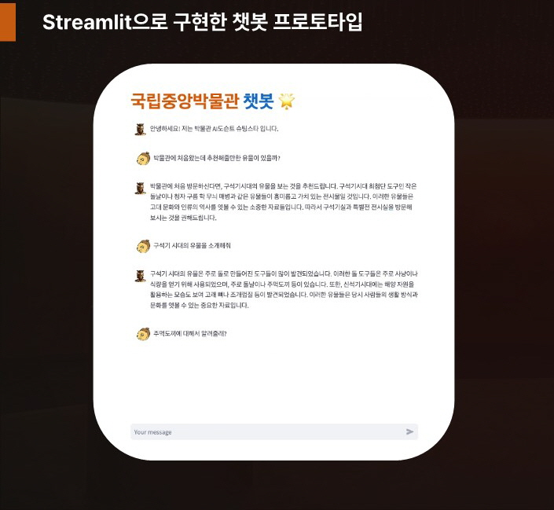
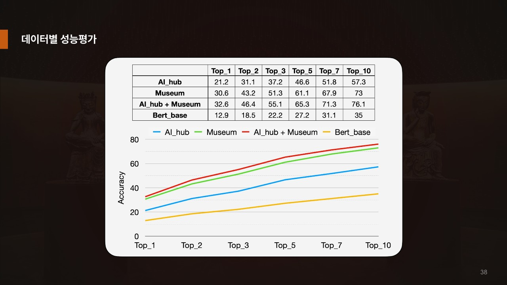
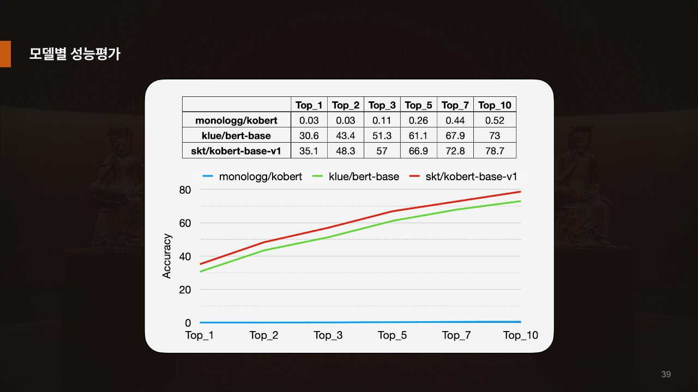
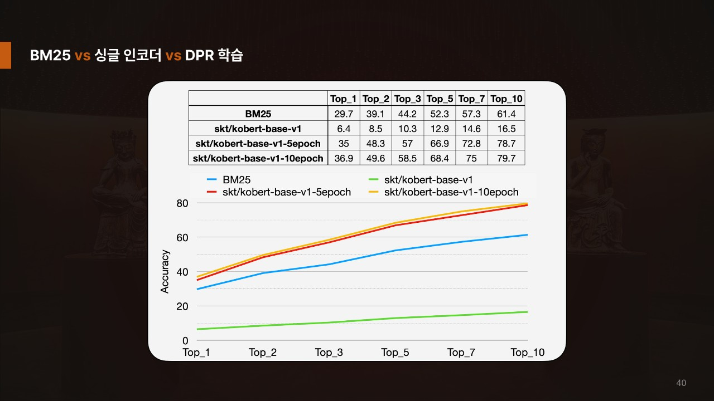

# 국립중앙박물관 챗봇
프로젝트 기간: 2023.11~2023.12 (6주)
사용언어: Python

## 📝Project

### 프로젝트 개요

- Hallucination이 없는 도메인 특화 챗봇 만들기 (RAG를 사용 그리고 Retriever로 DPR을 사용)

### 프로젝트 배경 

- 박물관 내국인 관광객 만족도 조사 결과 전달품질에 대한 만족도가 현저히 낮음 -> 이를 해결하기 위해 AI도슨트 챗봇을 제작 

### 사용 기술

- Python, Pytorch, Pandas, RAG with DPR, Beautifulsoup4 등

#### DPR 사용이유
- 기존의 BM25의 경우 키워드 기반 검색은 잘 되지만 질문에 내재된 의도를 파악하기 힘들다 -> DPR을 사용하면 질문의 의도 파악이 더 유리하다.

### 개발 인원

| 이름   | 담당업무 |
| ------ | -------- |
| 주성민 |    DPR 모델 학습     |
| 박상민 |     깃허브 관리, DPR모델 학습     |
| 이성준 |  모듈 개발, DPR모델 학습, UI 개발   |
| 최우성 |  평가모듈 개발, 모듈 개발  |
| 최효정 |  데이터 수집, 전처리  |

### 프로젝트 진행 과정
1. 국립중앙박물관 데이터 크롤링
2. 데이터 전처리
3. 예상질문 chatGPT 사용하여 생성
4. DPR 모델 학습
5. 랭체인을 이용해 DPR모델과 chatGPT 연결
6. steamlit을 이용해 배포

### 프로젝트 구현 내용 

### 모델별 성능 지표

> 비교 그래프 이미지

### 프로젝트 한계 및 개선 방안

#### 한계
- 질문을 GPT3.5을 활용해서 생성하였는데 퀄리티가 좋지 못함
- 자원과 시간 부족으로 DPR모델 학습에 epoch를 많이 가져가지 못함

#### 개선 방안
- GPT4.0 활용해서 생성하면 데이터셋의 품질이 더욱 개선 될 것
- 질문을 생성하는 과정을 비동기적으로 작동하게 작성하여 시간을 더욱 절약 할 수 있을것
- 배포된 사이트에서 사용자가 원하는 데이터셋을 적용 할 수 있게 해주면 더 좋을것 같다

## 🔍Reference

> 참조한 URL
